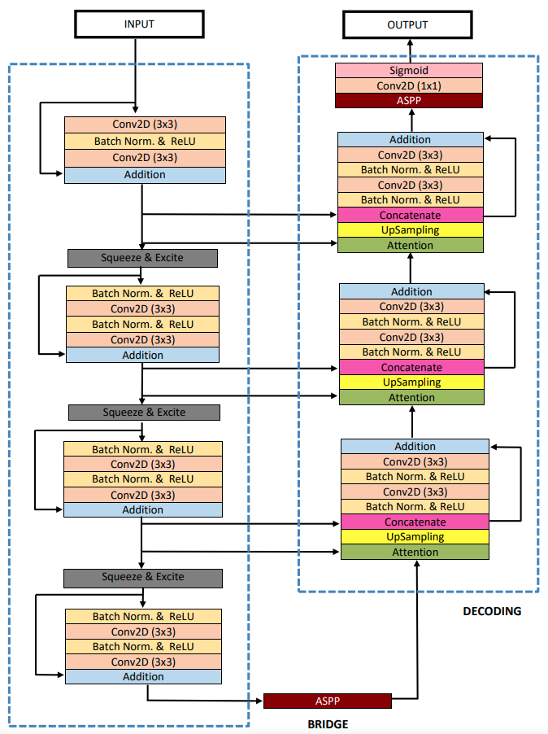

# ResUNet++-with-Conditional-Random-Field-and-Test-Time-Augmentation
# ResUNet++
The ResUNet++ architecture is based on the Deep Residual U-Net (ResUNet), which is an architecture that uses the strength of deep residual learning and U-Net. The proposed ResUNet++ architecture takes advantage of the residual blocks, the squeeze and excitation block, ASPP, and the attention block.  

## Architecture

## Datasets:
The following datasets are used in this experiment:
<ol>
  <li>MICCAI 2015 Segmentation challenge(CVC-ClinicDB for training and ETIS-Larib for Testing)</li>
  <li>CVC-ClinicDB</li>
  <li>Lesion Boundary segmentation challenge/li>
  <li> 2018 Data Science Bowl challenge</li>
 </ol>

## Hyperparameters:
 
 <ol>
  <li>Batch size = 16</li> 
  <li>Number of epoch = 300</li>
</ol>
<table>
  <tr> <td> Dataset Name</td> <td>Loss</td> <td>Optimizer</td> <td>Learning Rate</td>  </tr>
  <tr> <td>MICCAI 2015 Challenge Dataset</td> <td>Binary crossentropy</td> <td>Nadam</td> <td>1e-5</td> </tr>
  <tr> <td>CVC-ClinicDB</td> <td>Binary crossentropy</td> <td>Nadam</td> <td>1e-5</td> </tr>
  <tr> <td>Lesion Boundary segmentation challenge</td> <td>Dice loss</td> <td>Adam</td> <td>1e-4</td> </tr>
  <tr> <td>2018 Data Science Bowl challenge</td><td>Dice loss</td> <td>Nadam</td> <td>1e-4</td> </tr>
 </table>
 

## Results
The model is trained on CVC-ClinicDB and tested on the ETIS-Larib polyps dataset.  

