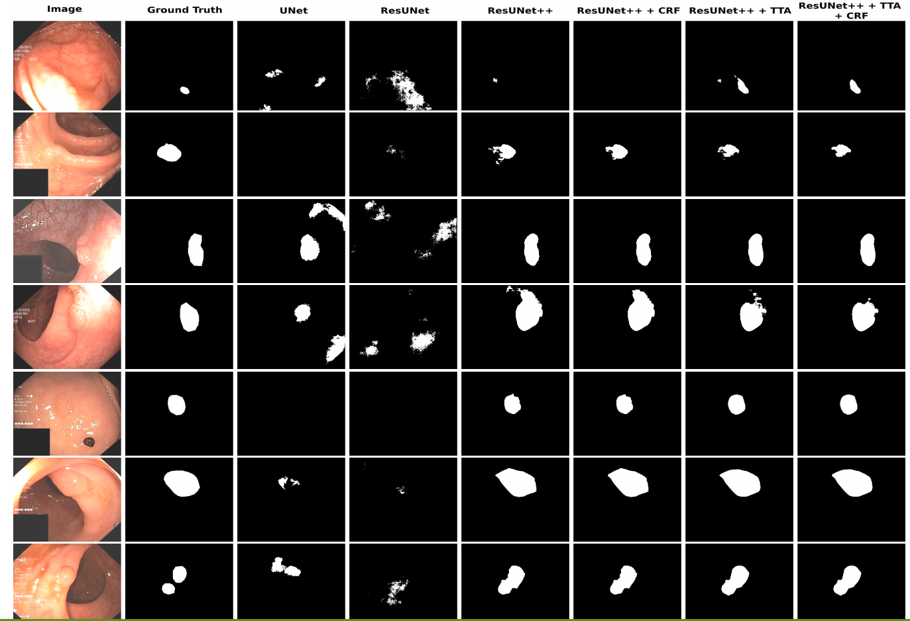

# ResUNet++-with-Conditional-Random-Field-and-Test-Time-Augmentation
# ResUNet++
The ResUNet++ architecture is based on the Deep Residual U-Net (ResUNet), which is an architecture that uses the strength of deep residual learning and U-Net. The proposed ResUNet++ architecture takes advantage of the residual blocks, the squeeze and excitation block, ASPP, and the attention block.    
<a href="https://arxiv.org/pdf/1911.07067.pdf"> ResUNet++: An Advanced Architecture for Medical
Image Segmentation </a>  

## Architecture

## Datasets:
The following datasets are used in this experiment:
<ol>
  <li><a href="https://datasets.simula.no/kvasir-seg/">Kvasir-SEG</a></li>
  <li><a href="https://polyp.grand-challenge.org/CVCClinicDB/">CVC-ClinicDB</a></li>
  <li><a href="http://mv.cvc.uab.es/projects/colon-qa/cvccolondb">CVC-ColonDB</a></li>
  <li><a href="https://polyp.grand-challenge.org/EtisLarib/">ETIS-Larib polyp DB</a></li>
 </ol>

## Hyperparameters:
 
 <ol>
  <li>Batch size = 16</li> 
  <li>Number of epoch = 300</li>
  <li>Loss = Binary crossentropy</li>
  <li>Optimizer = Nadam</li>
  <li>Learning Rate = 1e-5 (Adjusted for some experiments)</li>
</ol>
 

## Results
Qualitative result comparison of the proposed models with UNet, ResUNet, and ResUNet++. 

## Remark
Our work is under revision. 

